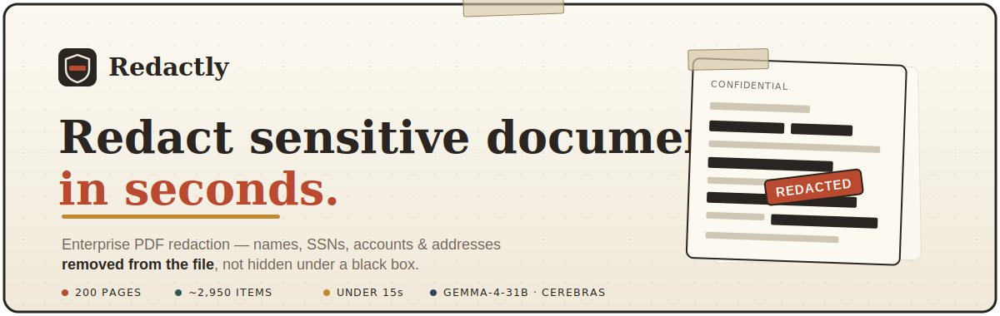
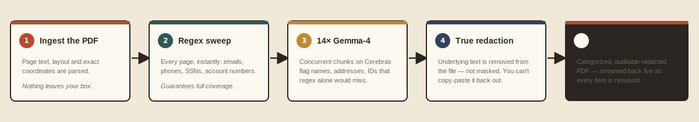

<div align="center">



<br>

[](https://tryredactly.vercel.app)
[](https://cerebras.ai)


### Drop in a PDF. Every name, SSN, account number and address — gone in seconds.

**Redactly** finds sensitive data with `gemma-4-31b` on Cerebras and **truly redacts** it — the underlying text is removed from the file, not hidden under a black box you can copy‑paste back out.

<br>

<a href="https://tryredactly.vercel.app"></a>

▶︎ **[Watch the full demo (MP4)](assets/demo.mp4)** &nbsp;·&nbsp; 🌐 **[tryredactly.vercel.app](https://tryredactly.vercel.app)**

</div>

---

## The problem

Teams handle confidential PDFs every day — HR records, settlements, discovery, medical and financial files — and "redaction" is often a black rectangle drawn over the text. The text is **still in the file**. Anyone can copy it out, or pull it from the PDF's content stream. Doing it properly is slow, manual, and easy to get wrong at scale.

## What Redactly does

- **True redaction.** The sensitive text is *deleted* from the PDF (`apply_redactions`), not masked. Nothing is recoverable.
- **Instant, at scale.** A **200‑page** confidential legal document → **~2,950 items removed in under 15 seconds**, watched live.
- **AI + deterministic.** A regex pass guarantees coverage on every page; `gemma‑4‑31b` adds the contextual catches (names, addresses, employee IDs) that patterns miss.
- **Auditable.** Every removed item is categorized and counted for your audit trail.
- **Yours.** Runs in your environment; files are processed in memory and never retained.

## ⚡ The headline run

| Metric | Result |
| --- | --- |
| Document | 200‑page confidential legal PDF |
| Sensitive items removed | **~2,950** |
| Wall‑clock | **< 15 seconds** |
| Concurrency | 14 parallel `gemma‑4‑31b` chunks on Cerebras |
| Categories | names · emails · phones · SSNs · accounts · addresses · DOBs · IDs |
| Redaction type | **true** — underlying text removed |

## How it works

<div align="center"></div>

1. **Ingest** the PDF — page text, layout and exact coordinates are parsed with PyMuPDF.
2. **Regex sweep** every page for emails, phones, SSNs and account numbers — instant, and guarantees nothing slips through.
3. **14 concurrent `gemma‑4‑31b` chunks on Cerebras** classify the contextual PII (names, addresses, IDs) that regex alone would miss.
4. **Apply redactions** — the matched text is removed from the file, page by page.
5. **Stream** a categorized, auditable, post‑safe PDF back to the UI live, with the page count, item count and tok/s ticking in real time.

## Why it's enterprise‑grade

- **Defensible.** True text removal stands up to copy‑paste, content‑stream extraction and OCR re‑lift.
- **Fast enough to be a workflow, not a ticket.** Sub‑15‑second turnaround on a 200‑page file.
- **Transparent.** A category breakdown per document for compliance and review.
- **Self‑hostable.** Single Python service — no third‑party document upload, no retention.

## Try it

🌐 **[tryredactly.vercel.app](https://tryredactly.vercel.app)** — landing page + the full demo.

Run the live app locally:

```bash
export CEREBRAS_API_KEY=csk-...     # your Cerebras key
pip install pymupdf
python3 server.py                   # → http://localhost:8130
```

Open it, drop in a PDF, or hit **“Try the 200‑page legal document”** and watch it race.

## Project structure

```
redactly/
├── server.py          HTTP service · /api/redact + /api/redact_stream (NDJSON)
├── index.html         single-file front end (drag-drop, live speed animation)
├── make_large.py      generates the 200-page legal demo doc
├── sample_large.pdf   the demo document (~2,950 PII items)
├── site/              static landing page deployed to Vercel
└── assets/            demo.mp4 · demo.gif · banner.svg · pipeline.svg
```

## Stack

`gemma-4-31b` on Cerebras (PII classification) · **PyMuPDF** (true PDF redaction) · Python `http.server` streaming NDJSON · single-file vanilla front end (Newsreader · IBM Plex Mono · Inter) · Vercel (landing page).

---

> **Use responsibly.** Process only documents you are authorized to handle. Built for the **Cerebras × Google DeepMind Gemma 4 hackathon** — Enterprise Impact.
